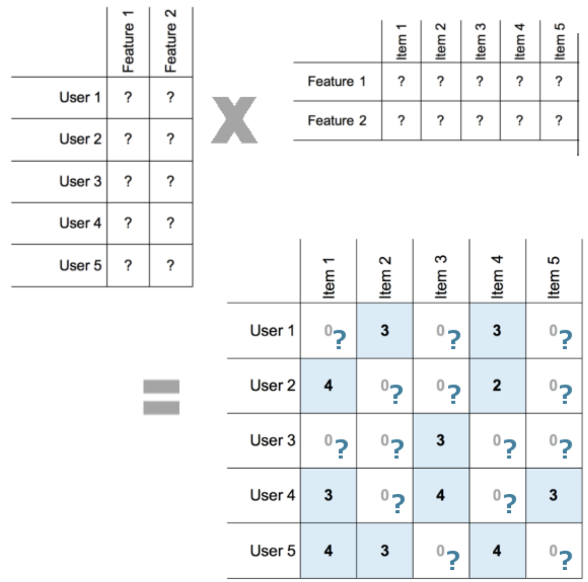
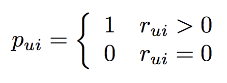
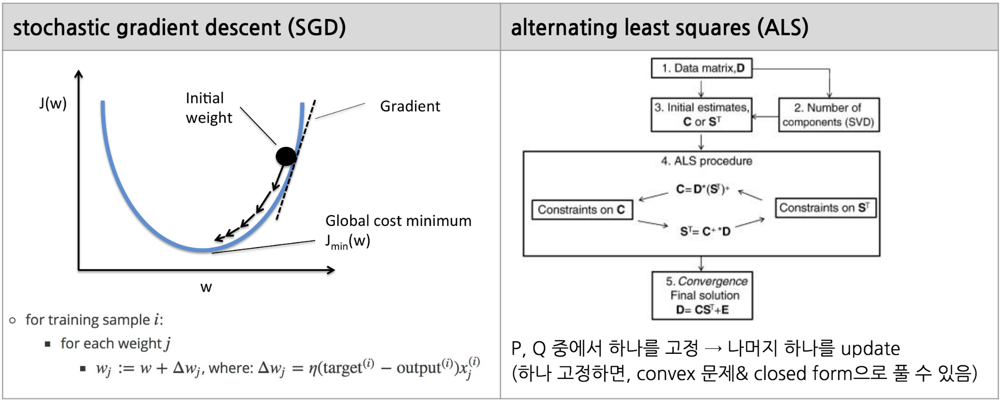
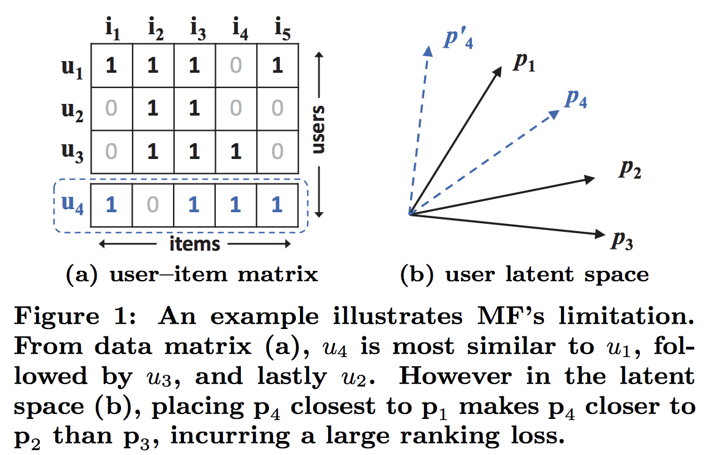
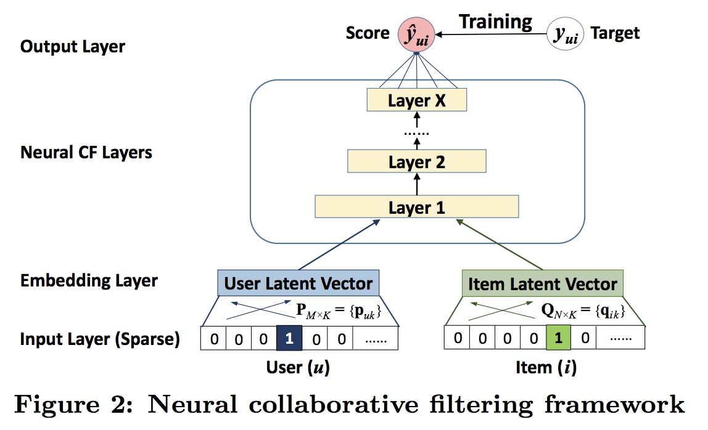
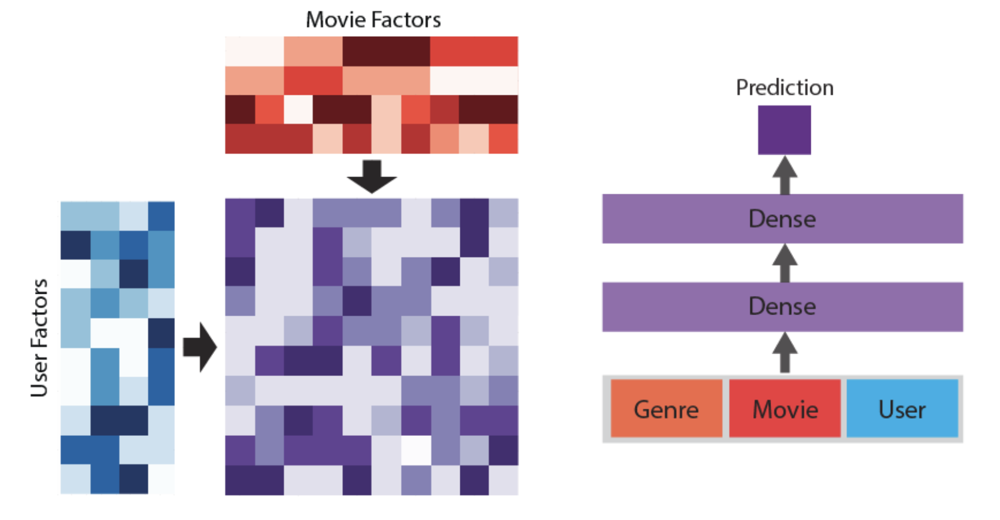

# Matrix Factorization with Neural Network

## 1) Matrix Factorization Recap
  - Latent Factor Model 방법 중 하나로 **사용자(User) & 아이템(Item)의** 특징을 Vector(Latent Variable)로 수치화 하고, 이를 통해 추천 스코어를 산출하는 방법 
  - 사용자(User) x 아이템(Item)의 추천 스코어는 Matrix 형태로 표현할 수 있으며, 이는 Incomplete (explicit feedback) 하거나 Sparse (implicit feedback) 한 Matrix 형태를 보임 
      * Explicit feedback : rating / review와 같이 특정 사용자의 특정 아이템에 대한 선호도 수치가 주어진 경우
      * Implicit feedback : 상품조회 / 클릭과 같이 사용자가 직접적인 점수를 주는 대신 간접적인 데이터가 주어진 경우 (log 성 데이터)
  - 이러한 Matrix를 2개의 Low Rank Matrix(사용자 & 아이템 차원보다)로 Decomposition, 즉, Low Rank Matrix(Latent Variable := Embedding values)을 생성하고 이를 이용해 Missing or Non-response values를 찾는 방법
  
 

  - **기존 Matrix Factorization 방법**
    * Latent Factor로 표현된 2개의 Matrix의 Dot Product(linear combination)가 Recommendation Matrix의 추천 값이 되며, 이 값 중 과거 기록과의 차이를 최소화 하는 Latent Matrix를 찾는 것이 목적
    * Performance Metric으로 RMSE를 주로 사용함
        * Preliminaries
          * Notation:
            * Indexing letters : For Users(사용자)   $`u`$ $`v`$,   For Items(아이템)   $`i`$ , $`j`$
            * observation : $`r_{ui}`$ (사용자 $`u`$가 아이템 $`i`$에 평가한 점수)
            * Latent Variables : For Users  $`x_u`$ (latent Variable과 사용자 u와의 관계벡터)    For Items  $`y_i`$  (latent Variable과 아이템 i와의 관계벡터)
          * Ratings for implicit feedback data
            * 특정 사용자 $`u`$가 특정 아이템 $`i`$에 대한 feedback이 존재할 경우 (즉, $`r_{ui} > 0`$), **1** 으로
            * 특정 사용자 $`u`$가 특정 아이템 $`i`$에 대한 feedback이 존재하지 않을 경우(즉, 아이템 구매/선호도 점수가 없을 경우 $`r_{ui}`$ is missing), **0** 으로
            * 
            
        * Loss Function
            * For Explicit Feedback
              * 
            * For Implicit Feedback
              * 
      
    * 일반적으로 Latent Facotr의 Dimension은 User / Item의 Dimension보다 작은 값을 이용
    * Matrix Factorization 방법으로 PCA / SVD 방법등이 있지만, Sparse & Incomplete Matrix이기에 Latent Matrices에 초기값을 주고 Iteration 마다 최적값을 찾아가는 Optimization 방법을 주로 이용
        * SGD (Stochastic gradient descent) or LAS (Alternating Least Squares) 방법 사용

        

  - **기존 Matrix Factorization의 한계점**
    * Linear Model(Dot product)로 사용자 혹은 아이템간의 유사도를 표현하는 데 한계가 있음
      * Ex) 2차원의 Latent Variable space에서 $`s_{23}`$(0.66) > $`s_{12}`$(0.5) > $`s_{13}`$(0.4) 일 경우를 가정, 신규 사용자(혹은 아이템) $`u_{4}`$의 similiarity가 $`s_{41}`$(0.6) > $`s_{43}`$(0.4) > $`s_{42}`$(0.2)일 경우 2차원에서 표현 불가
      * 차원을 늘릴 경우, overfitting의 문제가 발생할 수도 음

        

    * 사용자(Users)와 아이템(Items)의 Latent dim을 동일하게 해야함
      * 사용자 수가 훨씬 큰 경우, 아이템 수에 따라 상대적으로 낮지만 동일한 Latent dim을 사용하게 되면 서 사용자의 Latent Space가 잘 표현되지 않을 경우가 발생
    * 사용자(User)간 or 아이템(Item)간의 Inter-connection의 영향을 반영하기 어려움
    * Dot Product의 한계로 Latent Variables을 두 개만 사용 가능

## 2) Matrix Factorization with Neural Network (Deep Matrix Factorization)

  * **Matrix Factorization with Neural Network란?**
    * Nerual Network의 multi-layer representation을 이용하여 사용자(users) & 아이템(items)의 관계를 표현하는 모형
      
 
  * **Matrix Factorization with Neural Network의 장점**
    * Flatten Layer를 사용하기 때문에 Embedding Layer의 Latent Dimension의 크기를 다르게 가져갈 수 있음 (Ex. User는 10차원, Item은 5차원)
    * Matrix Factorization은 User간 or Item간의 Inter-connection의 영향을 반영하기 어렵지만, Flatten으로 펼쳐서 학습하기 떄문에 User간, Item간, User-Item간의 Inter-connection을 학습할 수 있음
    * Matrix Factorization에서 불가능한 non-linear connections을 표현 가능
    * Latent Factor를 표현하는 Embedding Layer를 2개 이상 할 수 있음 (Flatten & Concat 써서)
    * Dot Product가 없기에 학습속도가 빠름 (하지만 Layer의 depth가 클 경우 더 느릴 수 도 있음)
    * Deep Learning 방법론을 쉽게 적용해볼 수 있음 (ex. regularization을 위한 batch_norm, dropout, representation을 위한 residual 등)
    
 
 

 

 

 

## Summary
 - Non-linear 형태의 Deep MF 모델이, Implicit(ALS) 및 PyTorch(Vanilla Model)에 비해 CTR 기준 스코어가 더 높았음
    - Implicit모델 CTR : 0.0221
    - PyTorch Vanilla MF모델 CTR : 0.0138
    - PyTorch Deep MF모델 CTR : **0.0281**
            
        
 - Deep MF모델의 경우 더 개선할 만한 부분이 있음
    - Regularization을 위한 Layer 추가 (Ex. Batch Norm, Dropout) 혹은 Embedding layer 별 learning rate 조절
    - Embedding Layer(Input)의 Representation 학습
      - 참조 : https://github.com/apache/incubator-mxnet/blob/master/example/recommenders/demo1-MF.ipynb
    - User / Item 이외 데이터 활용
      - 1) Brand 별 카테고리(메타성 정보) Embedding Layer 추가
      - 2) User의 추가 feature 활용 (Wide & Deep Learning 모델 형태, https://arxiv.org/abs/1606.07792)
        
    
 - T멤버쉽 모델의 경우, Label에 대해 다시 정의를 해볼 수 있을 것 같음
    - Implicit Feedback 모형으로 Click한 경우 1, 아닌 경우(View & No Click, No View)는 0으로 
    - 실험해볼 필요가 있음

 

## Reference
- Collaborative filtering for implicit data (http://yifanhu.net/PUB/cf.pdf)
- Neural Collaborative Filtering (https://www.comp.nus.edu.sg/~xiangnan/papers/ncf.pdf)
- Matrix Factorization in PyTorch (https://www.ethanrosenthal.com/2017/06/20/matrix-factorization-in-pytorch/)
- T-membership with Matrix Factorization (https://gitlab.com/sktdmi/ds-weekly/tree/master/recommendations/TMEMBERSHIP-matrix_factorization)

